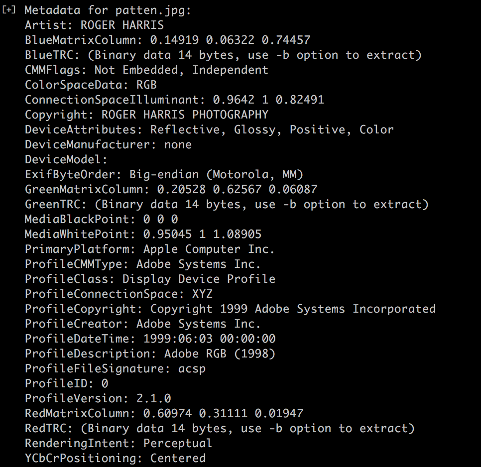
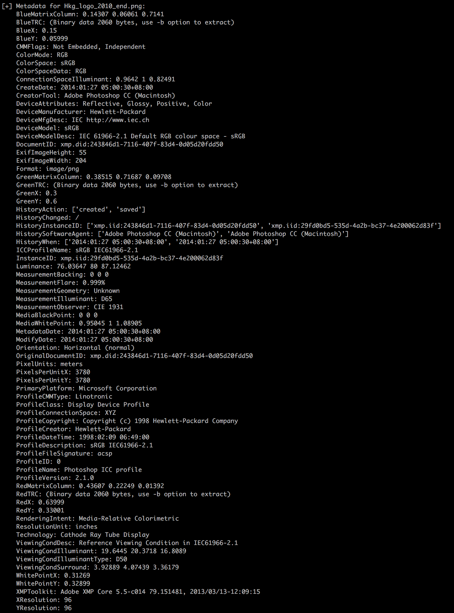
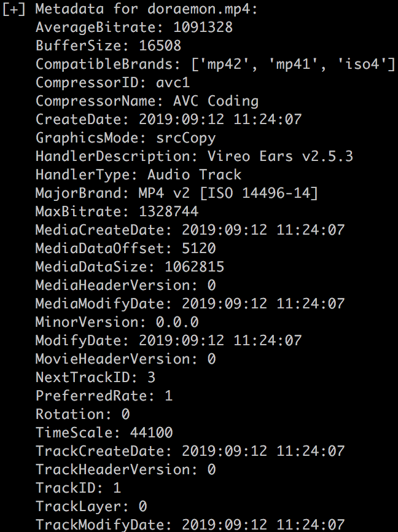
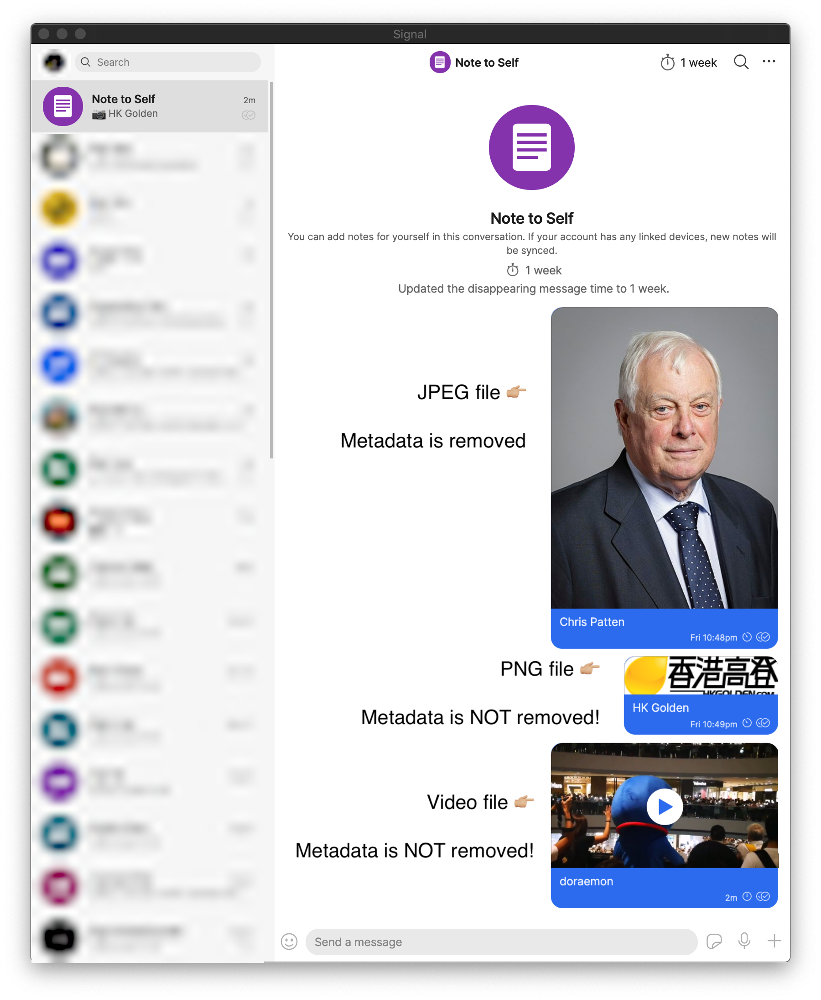
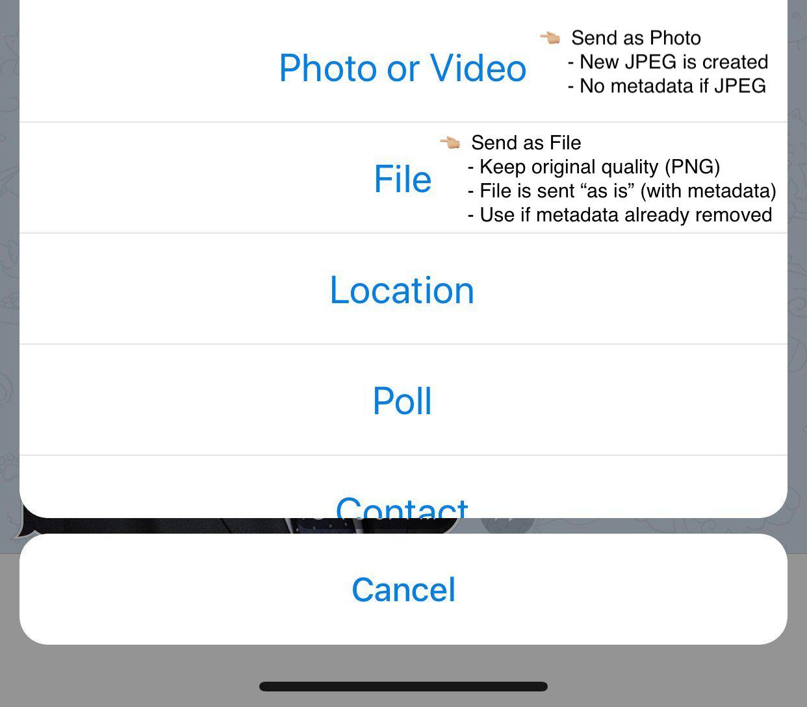
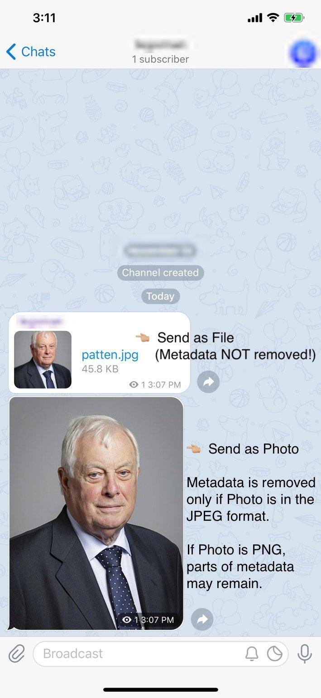

# Removing Metadata from Media

*Last Update: November 2020*

Whether you are taking photos or videos from your phone, or producing content using software such as Photoshop, Sketch, or other tools, the files you produce will often include `metadata` information that is not part of the content of your media, but still attached to the file.

The metadata will include information that may compromise your security and privacy. It will include information such as the geo-coordinates of where the photo had been taken, camera's settings (such as aperture and light, camera model), time and date, copyright information, software used to produce the media, and even the name or owner of the software license and the operating system information, ... you get the point.

Even if your name or direct identification is not in the metadata, relatively simple statistical techniques can be used to associate the other fields with you, or just a handful of other people. So in general, it is a good idea to remove all metadata information from your media files before sharing them with others. The last thing we want is to see an infographic file you created shared in a large public sea Telegram group, with metadata information that can be traced back to you.

**Summary**&nbsp; In this article, we will:

- Introduce `mat2` tool for viewing and removing metadata from most media files.
- Investigate the use of `Signal` / `Telegram` to remove metadata from JPEG images, and also highlight the **failure cases** of using such apps on removing metadata from 
- non-JPEG media.

## mat2

Created by privacy professionals, [mat2](https://0xacab.org/jvoisin/mat2) is one of the most trusted metadata removal tools that can remove as much metadata as possible from most media files. It is an open-source project created by hackers, and thus only available as a command line program, without any fancy graphic interface.

To install mat2 on MacOS, one first has to install [Homebrew](https://brew.sh/) (one line command via Terminal), and afterwards simply install mat2 in Terminal by typing `brew install mat2`. If you are a Python developer, you can also install mat2 by typing `pip install mat2`.

mat2 is not only useful for removing metadata, but also useful for viewing the metadata currently in a file, which makes the tool useful in our experiments later on to see how well other apps such as Signal and Telegram can remove metadata.

### Usage

Once installed, using mat2 is simple. Suppose one downloads an image of [Chris Patten](https://en.wikipedia.org/wiki/Chris_Patten) from wikipedia, and saves the image file as `patten.jpg` in the Desktop:

  

One can view the metadata inside this file using Terminal, and type:

`mat2 -s patten.jpg`

And the program will output the metadata inside the file:

  

As we can see, the name of the photographer, camera, software, and other information is inside this photo. To remove the metadata, we can type:

`mat2 patten.jpg`

And a new file, called `patten.clean.jpg` will be created that is free of any metadata. We can test this by typing:

`mat2 -s patten.clean.jpg`

And the output is simply `No metadata found in patten.cleaned.jpg`. It will then be safe to share `patten.cleaned.jpg` to other people even in a large chat group.

### Other Examples

In addition to the Chris Patten image, which is in JPEG format, I also tested two other files, in PNG format, typically used for design or infographic files as it is lossless compression, and also an MP4 video file. I have confirmed that mat2 can remove the metadata from these two different file types. In the case of MP4, some metadata fields are required, and mat2 will simply fill the metadata with default information, and removing all unnecessary metadata tags.

**Hkg_logo_2020_end.png**

  

**doraemon.mp4**
<video src="img/doraemon.mp4" type="video/mp4" autoplay muted playsinline loop style="display: block; margin: auto; width: 100%;" ></video>

Below are what the metadata looks like for these two files:

[PNG File](https://zh.wikipedia.org/wiki/%E9%AB%98%E7%99%BB%E8%A8%8E%E8%AB%96%E5%8D%80) | [MP4 file](https://twitter.com/JOceanW/status/1172108646156652544)
:----- | :----: 
Hkg_logo_2010_end.png   | doraemon.mp4
 | 

I understand that not everyone can install mat2 and use a command line program, so I also investigated ways of using existing apps, such as Signal and Telegram to remove metadata from image files. In the next sections, I will outline when we can use Signal and Telegram to remove metadata from our media, and also highlight the limitations of using those apps.

## Signal

Signal is an instant messaging app designed with privacy in mind. Reporters often use Signal to communicate with sources, and to exchange sensitive photos. As such, Signal has built-in functionality to automatically remove metadata, particularly geo-location information from media sent using the app. This means one can use Signal to help remove metadata from one's media files by sending them to oneself (using "Note to Self" chat group), deleting the original media, and saving the version sent to Signal back on one's device. (Don't do this yet until you read my findings about what works and what doesn't work below):

*Example of sending media files to yourself in Signal to remove the metadata (Note: only JPEG files have their metadata removed by Signal):*

  

However, upon my own investigation, I find that Signal actually fails to remove any metadata at all for PNG files, and does not remove metadata from Video files. The only file

Signal | Is Metadata Always Removed?
:----- | :----: 
JPEG   | ✔️ 
PNG    | ❌
Video  | ❌  

## Telegram

There are occasions when Telegram's functionality will help remove metadata from certain image files (JPEG in particular). I will discuss Telegram in this section. There are two ways to send a media file to someone else on Telegram. One is attaching a media (photo / video) (we refer this as "Send Media Option"), and the other is attaching a file (we refer this as "Send File Option").

*How to send a photo vs sending a file in Telegram:*

  

If one attaches a media file, Telegram will compress the media (meaning a PNG file will be converted to a JPEG, and a high quality JPEG file will be compressed to a lower quality one). This also means that the media file you send will no longer be the exact file sent to the channel, but another version of the file. As such, the metadata will be altered, depending on how Telegram app does it. After some investigation, I find that JPEG images sent will always have their metadata removed. However, PNG and Video will not always have their metadata removed.

*Example of sending a photo vs sending a file in Telegram a channel:*

  

Telegram (Send Media Option) | Is Metadata Always Removed?
:----- | :----: 
JPEG   | ✔️ 
PNG    | ❌
Video  | ❌  

Sometimes the designer will want to send a high quality version of an infographic or artistic design (i.e. usually a PNG image, not subject to any lossy JPEG compression), to a Telegram channel, One will send the media file with "Send File" mode, not "Send Photo / Video" mode. Note that in our tests, the file sent will not be altered by Telegram, so all the metadata will remain exactly the same.

Telegram (Send File Option) | Is Metadata Always Removed?
:----- | :----: 
JPEG   | ❌ 
PNG    | ❌
Video  | ❌  

If one wants to send a high quality infographic or art design, in PNG format via Telegram, I highly recommend removing the metadata from the file first, using the mat2 tool described earlier.

## Conclusion

If you are producing and organizing media files very frequently, or posting them on social media channels, I highly recommend installing `mat2` as it is the most trusted, and foolproof way to remove metadata from most media files.

If you only share files occasionally, or need to do so via a phone, away from your Desktop computer, I recommend sharing only JPEG image files that have the metadata removed using Signal.

On Telegram, as of writing, sending JPEG images (as photos, not as files), will make the app compress it and create a new JPEG file without any metadata, making it safe to send images. However, I have noticed that Telegram retains some metadata from PNG files compressed into JPEG files for whatever reason.

---

*If you would like to help improve this article, feel free to leave your suggestions in [issues](https://github.com/handfoot/securitytips/issues/new), or email handfoot at protonmail dot com*
